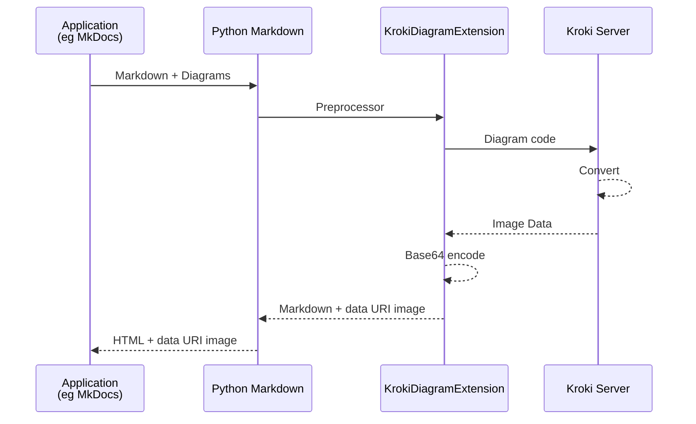

# markdown-kroki

Diagram extension for [Python-Markdown][python-markdown] using [Kroki server][kuroki].

This extension converts various diagram code blocks into SVG or PNG [data: URI][data-uri].
This enables PDF generation with tools like [WeasyPrint][wasyprint] without requiring JavaScript, even during web browsing.

[mermaid]: https://mermaid.js.org/
[python-markdown]: https://python-markdown.github.io/
[kuroki]: https://kroki.io/
[data-uri]: https://developer.mozilla.org/en-US/docs/Web/URI/Reference/Schemes/data
[wasyprint]: https://weasyprint.org/

## Install

```sh
pip install git+https://github.com/hkato/markdown-kroki.git
```

## Requirements

### Access the Kroki server via the Internet

Default setting with no options.

### Self-Managed Kroki server (recommended)

ref. Kroki.io > [Install](https://kroki.io/#install)

Here's a sample compose file.

```sh
docker compose up -d
```

## Usage

### Python code

````python
import markdown
from markdown_kroki import KrokiDiagramExtension

markdown_text = """```plantuml image=svg width=300
@startuml
Alice -> Bob: Authentication Request
Bob --> Alice: Authentication Response
@enduml
```"""

html_output = markdown.markdown(markdown_text, extensions=[KrokiDiagramExtension(kroki_url='https://kroki.io')])

print(html_output)
````

```html
<p></p>
```

### MkDocs Integration

```yaml
# mkdocs.yml
markdown_extensions:
  - markdown_kroki:
      kroki_url: http://localhost:18000/  # default https://kroki.io/
```

## Process flow


